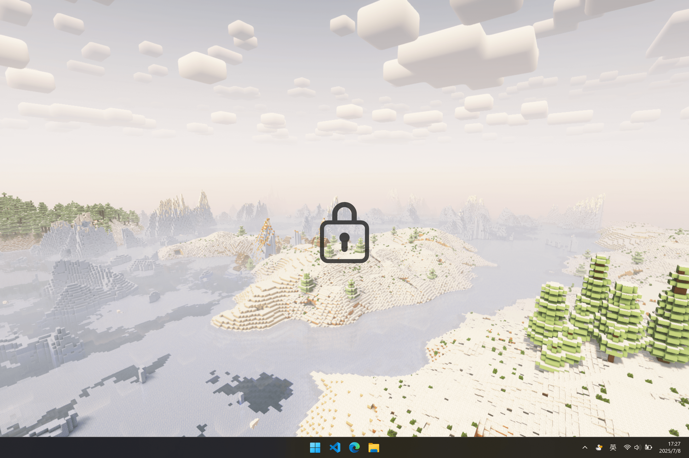
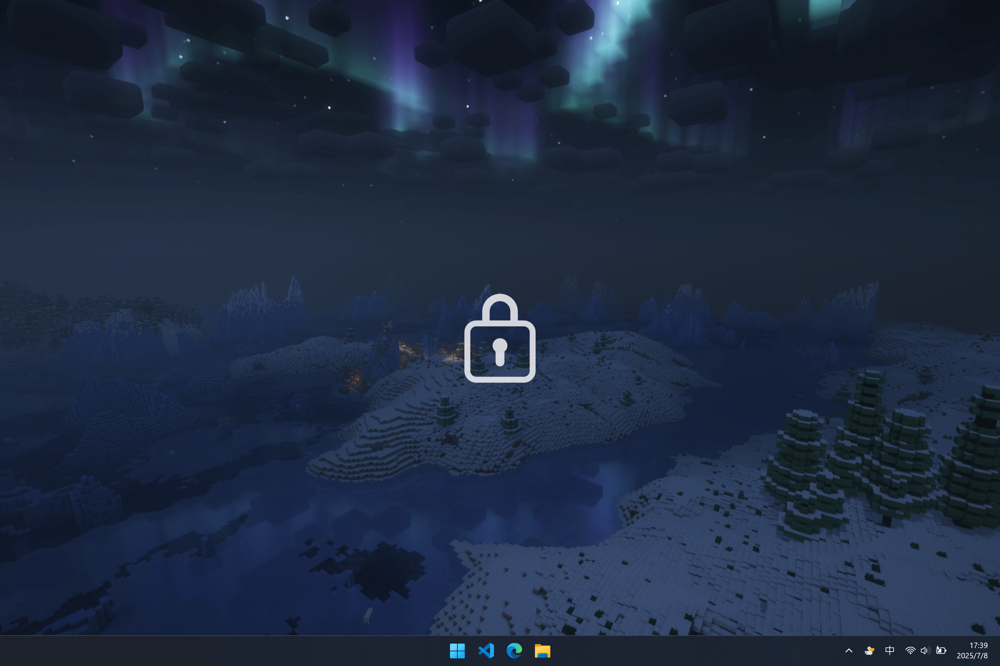

# CapsGlow
 
A lightweight Caps Lock indicator for Windows, supporting theme switching, monitor selection (mouse or primary), and flexible positioning. 🦆

一款适用于 Windows 的轻量级 Caps Lock 状态指示器，支持主题切换、显示器选择（主显示器或鼠标所在显示器）及灵活的位置设置。 🦆

## 🎨 Light Theme / 亮色主题

## 🌙 Dark Theme / 暗色主题

## Contributing / 贡献

Contributions are welcome! Please feel free to submit a Pull Request.

欢迎合并提交来贡献！

## Features / 功能
- [x] **Launch at Startup / 开机自启动**
- [x] **Theme Mode: Indicator Area (default) / System  
        主题模式：跟随指示器区域（默认） / 跟随系统**
- [x] **Monitor Selection: Under Mouse (default) / Primary Monitor  
        显示监视器：鼠标所在监视器（默认） / 主监视器**
- [x] **Monitor Position: Center (default)  
        监视器中的位置：居中显示（默认）**
---
- [x] **Customize Indicator Icon / 自定义指示器图标  
        Place the specified icon in the software directory / 在软件目录中放入指定图标  
        Default icon / 默认图标: `capslock.png`  
        Theme icon / 主题图标: `capslock_dark.png` + `capslock_light.png`**
---
- [x] **Higher Always-on-Top Priority When Run as Administrator  
        以管理员权限启动时，窗口置顶优先级更高（可覆盖开始菜单）**
---
- [ ] **Support NumLock, ScrollLock key indicator  
        支持 NumLock、ScrollLock 键指示器**
